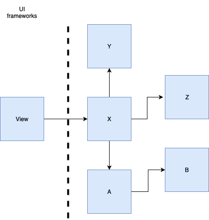

# NXDUI
NXDUI is a declarative UI wrapper for the built on top of UIKit. It allows building UI using a style that is as similar to SwiftUI as possible, running on iOS versions lower than 13.

To enable a smooth transition to SwiftUI when available, NXDUI is making a best effort to be source compatible with SwiftUI. However, this is not a hard requirement for any potential features in NXDUI.

⚠️The code in this repository is for demonstration purposes only. It will not be maintained nor shipped as a library. If you like the approach, consider creating your own version using NXDUI as inspiration.⚠️

To see NXDUI in action, open `NXDUISample.xcworkspace` and run the app.

## Why?

The iOS app is made up of a bunch of different components. Regardles of the architecture used to build a screen, there is one component that persists: **View**

Pre iOS 13, CocoaTouch offered 2 UI frameworks:

1. UIKit - for iOS applications
2. WatchKit - for WatchOS applications

With iOS 13, Apple introduced a new framework for UI - *SwiftUI*, packed with new features and a different way of writing the UI. 

The `View` component is isolated from the rest of the system and switching from UIKit to SwiftUI should be possible without affecting any other component in the system. While this sounds easy in theory, the practice is a bit different. The internal interfaces of UIKit shaped how the `View`s interface towards the rest of the system looks like, the effect of which could be noticed even on the components furthest away from it.

UIKit interfaces tend to optimize for performance by using fine grained *DataSources* and *Delegates* to display the UI:

 SwiftUI, on the other hand, assumes a different communication style between the components:

SwiftUI `View`s expose a single entry point - a `ViewModel` representing the entrie screen. Updating what's on the screen is as simple as giving a new `ViewModel` to the `View`. All of the diffing & animation logic is handled by SwiftUI.

-------------

Both SwiftUI and UIKit will inevitably influence the interface of the `View` component in their respective way. Assuming that we want to switch to using SwiftUI in the future, it's a good idea to start shaping our `View` interfaces in a way that's going to be the same to the `View` interfaces SwiftUI would provide. 

If that is the case, the switch from UIKit to SwiftUI will be a breeze. That's there NXDUI comes in.

## Benefits of NXDUI

#### Easier migration to SwiftUI in the future

Interface of a `View` component using NXDUI is nearly identical to the interface of a `View` component using SwiftUI. Interface stability will allow for a smooth transition from UIKit to SwiftUI without the need to change any of the other components in the system.

#### Adapting to the code style used with SwiftUI

The interface of the `View` component will influence the way other components of the system are built. The components built today with UIKit backed `View`s differ from the ones with SwiftUI backed `View`s. This allows us to gain experience and cultivate best practices even before we can use SwiftUI. 

#### Less boilerplate

Writing `View`s & other components requires less boilerplate. The `View`s require less code to achieve the same UI, and NXDUI will handle all of our diffing needs out of the box. No more `tableView.beginUpdates()`

#### Ease of reusability

The internal building blocks of SwiftUI make building and reusability of UI components a breeze. Simply declare how your UI component should look like, and NXDUI takes care of the rest.
